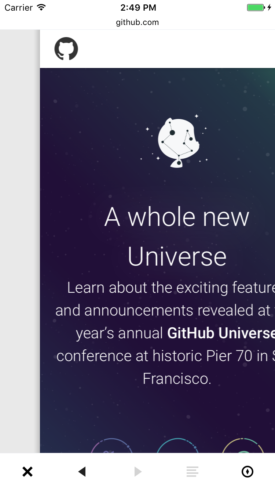
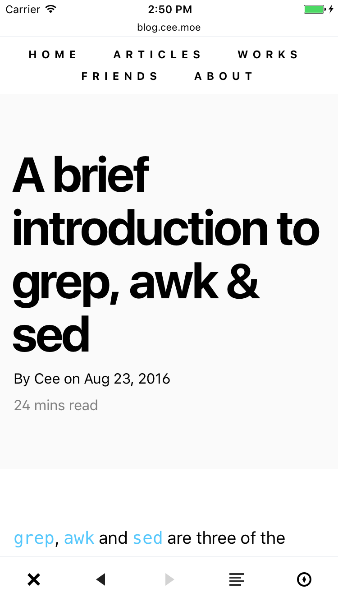
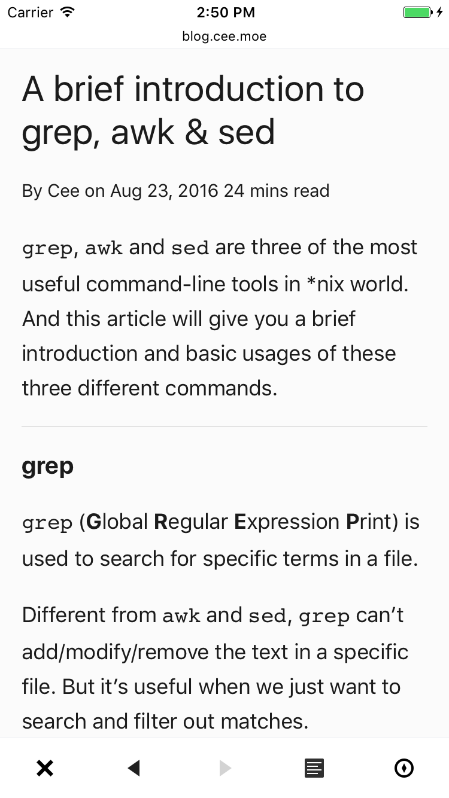

# PFWebViewController

[](http://cocoapods.org/pods/PFWebViewController)
[](http://cocoapods.org/pods/PFWebViewController)
[](http://cocoapods.org/pods/PFWebViewController)
[](http://cocoapods.org/pods/PFWebViewController)

## Features

- A light-weight webview controller using WKWebView. Only supports iOS 9 and above.

- Easy use and less memory consuming than [RxWebViewController](https://github.com/Roxasora/RxWebViewController).

- Support Safari-like reader mode.

## Screenshots

### Loading


### Main Screen




### Reader Mode




## Installation

### Using Carthage

Add `PFWebViewController` to your `Cartfile`:

```
github "PerfectFreeze/PFWebViewController"
```

Run `carthage` to build this framework.

Add `PFWebViewController.framework` to your Xcode project.

### Using CocoaPods

Add `PFWebViewController` to your `Podfile`:

```ruby
pod 'PFWebViewController', '~> 1.1.1'
```

Run `pod install` to install this framework.

### Manually

Drag `Classes` folder to your project.

## Usage 

```objective-c
// Init with a string
PFWebViewController *webVC = [[PFWebViewController alloc] initWithURLString:@"https://github.com"];

// Or with an URL
NSURL *url = ...;
PFWebViewController *webVC = [[PFWebViewController alloc] initWithURL:url];

// Optional: Set Progressbar's Color, default is black
[webVC setProgressBarColor:[UIColor redColor]];
    
// Present in a single view
[self presentViewController:webVC animated:YES completion:nil];

// Or push in a navigationController
[self.navigationController pushViewController:webVC animated:YES];
```
## Further Reading

- [How to implement Safari-like reader mode in PFWebViewController](http://sergiochan.xyz/2016/10/21/%E5%A6%82%E4%BD%95%E5%9C%A8-WKWebView-%E4%B8%AD%E5%AE%9E%E7%8E%B0-Safari-%E5%8E%9F%E7%94%9F%E7%9A%84%E9%98%85%E8%AF%BB%E6%A8%A1%E5%BC%8F/)

## License

This project is released under the terms and conditions of the [MIT license](https://opensource.org/licenses/MIT). See [LICENSE](LICENSE) for details.
